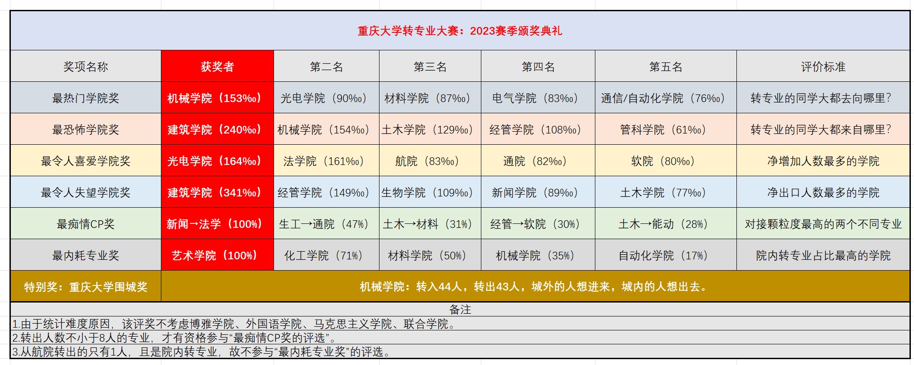

# 2023级转专业数据总结

## 一、2023级转专业概览

## 二、问卷数据

!!! warning
    该部分数据来源于极少量的样本调查，样本偏差大，不具有普适性，请谨慎参考。

    部分内容由AI总结生成。

<html lang="zh-CN">
<head>
    <meta charset="UTF-8">
    <meta name="viewport" content="width=device-width, initial-scale=1.0">
    
    
</head>
<body class="stat-dashboard">    
    

        <!-- 转专业时间点分析 -->
        

            <h2>转专业时间点分布</h2>
            

                <canvas id="timeChart"></canvas>
            

        

        
        <!-- GPA分布及与转专业类型的关系 - 横向排布 -->
        

            

                <h2>GPA分布情况</h2>
                

                    <canvas id="gpaChart"></canvas>
                

                
数据显示中高绩点(3.5-3.69)的学生占比最大，为43%，其次是高绩点(3.7及以上)学生占36%，中高绩点(3.2-3.49)学生占21%。

            

            
            

                <h2>转专业类型选择</h2>
                

                    <canvas id="transferTypeChart"></canvas>
                

                

                    
<strong>平转</strong>：大二上学期结束后62%的学生选择平转，大一上学期结束后100%选择平转

                    
<strong>降转</strong>：仅在大二上学期结束后有38%的学生选择降转

                

            

        

        
        <!-- GPA与转专业类型的关系 -->
        

            <h2>GPA与转专业类型的关系</h2>
            <table class="stat-table">
                <tr>
                    <th>转专业类型</th>
                    <th>GPA分布</th>
                    <th>占比</th>
                    <th>特点</th>
                </tr>
                <tr>
                    <td rowspan="3">平转</td>
                    <td>高绩点优势群体 (≥3.8)</td>
                    <td>33%</td>
                    <td>反映部分学生凭借顶尖学业成绩获得平转资格</td>
                </tr>
                <tr>
                    <td>中高绩点竞争群体 (3.5-3.79)</td>
                    <td>44%</td>
                    <td>平转主要依赖中等偏上学术表现</td>
                </tr>
                <tr>
                    <td>中绩点申请者 (<3.5)</td>
                    <td>22%</td>
                    <td>可能存在竞赛获奖、专业特长等非学术因素支撑</td>
                </tr>
                <tr>
                    <td rowspan="2">降转</td>
                    <td>中高绩点主流选择 (3.5-3.7)</td>
                    <td>80%</td>
                    <td>降转主要服务于中等学业水平学生的专业调整需求</td>
                </tr>
                <tr>
                    <td>中绩点破局尝试 (<3.5)</td>
                    <td>20%</td>
                    <td>可能涉及学习适应度评估或职业规划调整</td>
                </tr>
            </table>
        

        
        <!-- 转专业原因分析 -->
        

            <h2>转专业主要原因分析</h2>
            

                <canvas id="reasonChart"></canvas>
            

            
            

                
43%

                

                    
专业兴趣不匹配

                    

                        表现为对原专业内容缺乏兴趣或学习困难。
                        查看来源
                            
                                来源（问卷原内容）
                                "不喜欢原专业" 
                                "原专业内容涉及三维空间相关知识，立体感不好，学习困难" 
                                "原专业就业；学院组织不满意"
                            
                        
                    

                

            

            
            

                
29%

                

                    
就业前景担忧

                    

                        原专业就业前景差与学习压力形成负面情绪。
                        查看来源
                            
                                来源（问卷原内容）
                                "专业前景" 
                                "原专业就业前景差，身边同学士气低落，加之建筑学习压力本身就大，个人精神状态持续不稳定"
                            
                        
                    

                

            

            
            

                
29%

                

                    
职业发展规划

                    

                        专业前景直接关联未来职业机会与收入水平，而保研则可能影响长期职业路径的选择。
                        查看来源
                            
                                来源（问卷原内容）
                                "保研" 
                                "职业发展"
                            
                        
                    

                

            

        

        
        <!-- 转专业面临的挑战 -->
        

            <h2>转专业面临的主要挑战</h2>
            

                <canvas id="challengeChart"></canvas>
            

            
            

                
43%

                

                    
学业压力与竞争

                    

                        高强度学习任务和激烈绩点排名竞争。学生需同时应对原专业和新专业课程，时间管理压力大；绩点和排名直接决定转专业资格。
                        查看来源
                            
                                来源（问卷原内容）
                                "大三上太忙了，大家太卷了" 
                                "电气也太卷了，而且电磁场难死了" 
                                "绩点、排名，能否成功"
                            
                        
                    

                

            

            
            

                
43%

                

                    
课程衔接

                    

                        学习方向不明确可能导致学生对未来职业规划的迷茫，而选课问题则直接关系到能否顺利衔接新专业的课程体系。
                        查看来源
                            
                                来源（问卷原内容）
                                "学习方向" 
                                "选课"
                            
                        
                    

                

            

            
            

                
14%

                

                    
心理适应

                    

                        转专业过程中的心理与适应挑战主要体现在情绪波动和环境变化带来的压力。
                        查看来源
                            
                                来源（问卷原内容）
                                "焦虑的心情，孤注一掷的念头，难以面对可能失败的结果" 
                                "成功后搬迁宿舍的麻烦，一些手续较为繁琐，陌生环境的孤独感" 
                                "因为机器人太勾八卷了 🤬"
                            
                        
                    

                

            

        

    

    
</body>