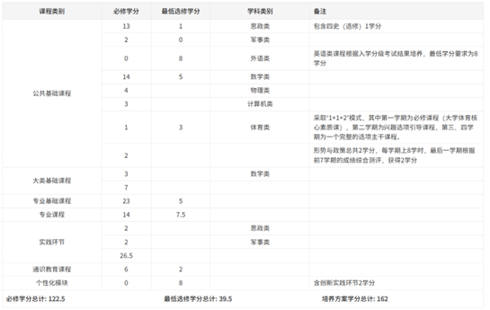

# 准备工作与报名

## 一、辅修

在大一结束进行大类的专业分流的同学通常只能在大二上学期结束后的寒假申请转专业，从而导致了较重的补课负担。如果您正处于大一，且将在大一结束时进行大类的专业分流，且想要转专业又不想降级，那么辅修将成为帮助您转专业和补课的利器。

### 1、辅修的时间

通常学校会在暑假期间发布辅修的申请通知，且申请通道可能会在秋季学期开学前关闭。如果您在大一的暑假期间提交了您想转的专业的辅修申请且被通过，那么您就可以在大二上时辅修您想转的专业的课程。您在辅修期间修读的课程成绩不会被计入主修专业的绩点中，但如果您转专业成功，通常您辅修时所修读的课程的学分与成绩就可以被计入，从而减轻补课的负担，即使您转专业失败，您也可以选择中止辅修。

### 2、辅修的利弊

辅修为您带来的优势主要包括：

- 减轻您未来的补课负担。
- 大大增加您在转专业面试时的竞争力。
- 获得意向学院的教务老师的联系渠道（通常是qq），更便于您随时提问。

辅修的劣势可能包括：加重您大二上学期的学习负担，可能会影响您原专业课程的学习，从而影响您的绩点。

!!! note
    总的来说，辅修是一种用大二上的时间提前修读意向专业的课程，以减轻大三上的补课压力的操作。

### 3、专业辅修的意外问题处理

在为了转专业进行辅修的过程中，由于课程压力增大以及种种疏忽情况，您可能会遇到各种在程序上及其棘手的问题，但这些问题并非不能解决的。下面是我们收集往届同学遇到的的一些相关棘手问题及其解决方案，希望能对您提供有益帮助。

???+ danger "辅修计算机类课程挂科导致选课问题"
    **问题描述**：在转专业之前辅修计算机类专业，选了《程序设计基础》（也可以是其他计算机类课程，如‘离散数学’）但是由于自身原因，出现挂科情况（包括补考也未通过）。成绩记录如下：
    
    转专业成功后，《程序设计基础》（或其他计算机类课程）成为了当前专业的主修课，这样就出现了一个bug：这门挂科的课程只出现在重修页面，无法选这门课，但是毕业审查这门课却显示灰色的。

    **解决方案**：首先要确保已经把辅修退了（没有退很难说清楚），然后找学院教务进行特殊选课，学院教务能够直接选择某门课是初修还是重修。

    **其他说明**：
    1. 如果出现挂科，但是补考通过的情况（此情况已获得学分），该课程不会出现在重修列表，也不会出现在选课列表，这时候需要找学院教务将该辅修课程记录消去（之所以前面的补考不通过的情况无法消去挂科记录是因为未获得学分）。
    2.  辅修挂科不影响保研，不影响一切评奖评优（即不影响除了拿辅修学位证书以外的一切事务）
    3.  转专业的学院审查步骤，教务可能会查到有挂科记录，并打电话核查，这时候只需要解释该科目是辅修科目即可

## 二、培养方案的阅读

阅读和对比各专业的培养方案，是帮助您了解专业与补课压力，制定补课计划的重要环节。培养方案可以在[教务系统-培养方案库]处搜索得到，每个专业每一级都有单独的一份培养方案，请注意区分。下面对部分可能造成困惑的地方和重要的地方进行解释说明。

### 1、开学学期

在"课程设置"一栏中，您可以看到该专业需要学习的课程的表格。其中，有一列为"开学学期"，他表示这门课程正常情况是在哪个学期修读。

具体的，1-10分别表示大一上学期，大一下学期，大二上学期......。S1表示大一下的小学期，S2表示大二下的小学期，S3表示大三下的小学期。

### 2、课程类别的划分

在"毕业学分要求及学分分布"一栏中，可以找到下表。这里以2023级电子信息工程本科培养方案为例。

课程会分为以下几类：

首先根据"课程类别"分为：

- 公共基础课程
- 大类基础课程
- 专业基础课
- 专业课程
- 实践环节
- 通识环节
- 个性化模块

每一类还可分为：

- 必修类型
- 选修类型

!!! info
    通常情况下，所有必修类的课程都是必须修读的，而所有选修课程，则需要满足最低选修学分的要求。

1. 某些类型会根据"学科类别"进行第三次分类，不同学科类别有各自的学分要求：
   - 例如：公共基础课程类中，计算机类课程必修3学分，无最低选修学分要求
   - 而数学类则要求必修14学分，最低选修5学分

!!! warning
    某些特别的学分和课程类型（如通识教育模块和个性化模块等）对课程修读存在特殊的要求。这部分特殊要求在不同年份和不同专业都存在差异，难以概括介绍，故请您自行查找学校发布的最新相关说明，或通过询问教务老师了解具体要求。

### 3、如何判断哪些课程需要选择

除了通识教育课程和个性化模块外，通常您可以简单的通过"最低选修学分"一栏的要求进行判断。

例如：

- 在2023级电子信息工程本科培养方案中，专业基础课程类的选修课程一共有5学分

- 根据要求，最低选修学分也为5学分

- 因此即使这两门课程被标为"选修"，您最终也必须全部完成这两门课程的修读

!!! tip
    如果选修课程的总学分数高于该类选修课程的最低学分要求，那么您就可以从中选择部分课程，只要最终满足最低学分要求即可。

## 三、报名:material-tooltip-edit-outline:{ .mdx-pulse title="章节编写中" } 